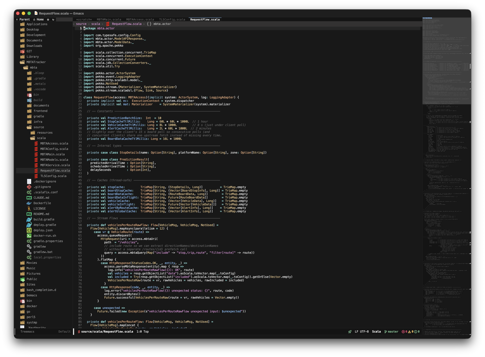

# gm Emacs workstation

A reproducible GNU Emacs 30.2 configuration for Apple Silicon macOS. It uses a
Cursor Dark-inspired theme, Menlo 12, a project explorer, editor tabs, search and
terminal panels, language servers, debugging, Git tooling, and hybrid macOS/Emacs
keybindings. A native Codex task panel gives project-scoped coding agents direct,
sandboxed access to the active Git workspace.

## Screen layout



The VSCodium-style workspace combines Git workspace tabs, scoped editor tabs,
the `$HOME` explorer, LSP status, Git integration, and an optional right-side
code minimap.

## Supported languages

Scala, Python, TypeScript/TSX, Angular 20, Java, Groovy, Gradle, Bash, YAML,
HOCON, JSON, and Swift are configured. Tree-sitter is used where GNU Emacs 30
provides a corresponding major mode; LSP Mode supplies IDE navigation,
completion, diagnostics, actions, and debugger integration.

## First installation

Preview the complete machine-specific plan before installing anything:

```bash
./bin/bootstrap-macos --dry-run
./bin/register-jdks-macos --dry-run
./bin/cutover-emacs-macos --dry-run
```

Dry-run mode performs read-only inspection and labels each result as
`PRESERVE`, `WOULD INSTALL`, `WOULD CREATE`, `WOULD UPDATE`, or `BLOCKED`. It
does not create the baseline, download dependencies, change shell files, invoke
Homebrew mutations, request administrator privileges, stop Emacs, or modify
applications and JDK registrations. This makes the same scripts safe to assess
on a new personal, work, or CI Mac whose existing Emacs and JDK versions differ.

The bootstrap installs Homebrew dependencies, the Node 24 language-server
toolchain, Metals 1.6.8, Emacs packages, and Tree-sitter grammars:

```bash
./bin/bootstrap-macos
```

Before changing the machine, bootstrap writes a timestamped baseline under
`~/.local/state/gm-emacs/baselines/`. It records the current Emacs application,
all Homebrew formula and JDK versions, registered JDK paths, and copies the
ignored `elpa/` and `var/` runtime directories. Existing Homebrew packages and
JDKs are preserved: bootstrap disables upgrades, dependent repairs, and cleanup,
then installs only missing `Brewfile` entries. OpenJDK 17 and 21 are installed
only when absent; any generic or additional JDK remains untouched.

The bootstrap builds the Groovy Language Server from a pinned upstream revision
because that project does not publish binary releases. To repair or reinstall
only that server, run `./bin/install-groovy-language-server`. Its proposed build
can be inspected independently with
`./bin/install-groovy-language-server --dry-run`.

If `.bashrc` or `.bash_profile` contains a Cellar-version-specific OpenJDK 21
path, bootstrap replaces only that path with the stable
`/opt/homebrew/opt/openjdk@21/libexec/openjdk.jdk/Contents/Home` symlink. Each
changed file receives a timestamped adjacent backup first. Other JDK paths are
not modified.

The baseline and shell-path stages can also be previewed independently with
`./bin/capture-install-baseline --dry-run` and
`./bin/stabilize-jdk21-shell-paths --dry-run`.

It deliberately does not alter `/Applications` or `/Library`. After bootstrap,
register the JDKs and cut over the GUI application:

```bash
./bin/register-jdks-macos
./bin/cutover-emacs-macos
./bin/check
```

The JDK registration command uses `sudo` only for three explicit symlinks under
`/Library/Java/JavaVirtualMachines`. The cutover command accepts only a verified
Emacs Plus 30.2 build and a known Emacs 26.1, 29.3, or 30.2 destination. It
stages and validates the new app before moving the previous app to the Trash.

### Rollback

If the new application must be rolled back, quit Emacs, move
`/Applications/Emacs.app` aside, and restore the timestamped Emacs 26.1 bundle
or Emacs 29.3 bundle from `~/.Trash`. The prior Homebrew formula is not
uninstalled. Runtime caches under `elpa/`, `tree-sitter/`, `var/`, `.local/`,
and `tools/node_modules/` can be discarded and rebuilt; none are tracked by Git.
The pre-install copies of `elpa/` and `var/` are also available from the baseline
directory printed by bootstrap.

## Java policy

| Version | Purpose |
|---|---|
| OpenJDK 17 | Metals and Java 17 projects |
| OpenJDK 18 | Legacy compilation and testing only |
| OpenJDK 21 | Default Emacs runtime, JDT LS, Groovy, and fallback projects |

Java 18 is an archived, non-LTS release. The bootstrap preserves the existing
Homebrew 18.0.2 bundle independently under `~/.local/share/jdks`; if it is
absent, it installs the official OpenJDK 18.0.2+9 archive after SHA-256
verification. This separation allows current Homebrew tools to use their
supported JDK without replacing Java 18. Java 18 is never the language-server
default.

The bootstrap never upgrades or unpins an installed JDK. This allows machines
with older patch releases or additional JDKs to retain them while adding only
missing managed Java 17 and Java 21 runtimes.

After JDK setup, bootstrap runs `bin/discover-java-runtimes`. The command
discovers registered macOS JDKs, stable Homebrew prefixes, and user-local
archives; starts each candidate once to determine its actual major version; and
writes the ignored machine-local registry at `var/java-runtimes.properties`.
It never infers a version from a Homebrew formula name, so a generic or stale
alias is recorded under the major reported by its JVM. One preferred path is
retained for every discovered major, including unmanaged installations.

The registry also assigns logical roles:

```properties
EMACS_JDK=JDK21
JDTLS_JDK=JDK21
METALS_JDK=JDK17
GROOVY_LS_JDK=JDK21
```

Refresh it after installing, removing, or relocating a JDK. Existing valid role
choices are preserved, replacement is atomic, and the prior registry receives
a timestamped adjacent backup:

```bash
./bin/discover-java-runtimes --dry-run
./bin/discover-java-runtimes
./bin/discover-java-runtimes --check
```

Emacs and the Metals and Groovy wrappers parse this file as strict, inert
`KEY=VALUE` data; it is never sourced or evaluated. Normal Emacs startup only
checks the recorded executable paths and does not launch a JVM. Live version
checks are reserved for `--check`, `M-x gm/java-status`, and
`M-x gm/health-check`. If the registry is missing or stale, Emacs still starts
and emits one warning explaining how to regenerate it, while Java language
services remain unavailable.

Within Emacs:

- `M-x gm/java-status` reports paths, versions, roles, and the project selection.
- `M-x gm/java-use-version` selects any discovered runtime for the current project and
  restarts its LSP workspace.
- Every discovered key (`JDK17`, `JDK18`, `JDK21`, and so on) is exported to
  Emacs child processes and integrated terminals.
- Gradle repositories may use
  `org.gradle.java.installations.fromEnv=JDK17,JDK21` to discover those aliases.
  Project toolchains and daemon JVM criteria remain authoritative; no
  machine-specific path is written into project `gradle.properties`.

See the Gradle documentation for [toolchains](https://docs.gradle.org/current/userguide/toolchains.html)
and [daemon JVM selection](https://docs.gradle.org/current/userguide/gradle_daemon.html).

## Layout and shortcuts

The top tab bar contains one workspace per explicitly registered Git worktree
and one permanent **Global** workspace. Open a repository with
`M-x gm/workspace-open`; selecting a file from a registered repository routes it
to that workspace, while loose files and unregistered repositories use Global.
Closing a repository workspace never kills its buffers.

Treemacs occupies the left sidebar. Repository workspaces expose exactly their
Git root and cannot navigate into parent directories. Global starts at `$HOME`
and provides **Parent**, **Home**, **Reveal**, and **Refresh** controls for loose
browsing. From the keyboard, `^` moves the Global root to its parent, `~`
switches to Global at `$HOME`, `.` reveals the active file, and `g` refreshes the
tree. The existing tab-line remains below the workspace bar and shows only files
belonging to the selected workspace.

Vterm, builds, tests, and diagnostics share a bottom panel. Project search uses
a persistent ripgrep results panel. An optional code minimap opens on the right
edge of the active editor and supports mouse navigation; it remains off until
requested so the Codex sidebar can retain the full panel width.

| Shortcut | Action |
|---|---|
| `Cmd-P` | Find project file |
| `Cmd-Shift-P` | Command palette |
| `Cmd-B` | Toggle explorer |
| `Cmd-Shift-F` | Project search panel |
| `Cmd-F` | Search current buffer |
| `Cmd-J` | Toggle integrated terminal |
| `Cmd-I` | Start a workspace-writing Codex task |
| `Cmd-Shift-I` | Toggle the Codex sidebar |
| `Cmd-Shift-O` | Document symbols |
| `F12` / `Shift-F12` | Definition / references |
| `Cmd-.` | LSP code action |
| `Cmd-S` / `Cmd-W` | Save / close buffer |
| `Cmd-Shift-[` / `Cmd-Shift-]` | Previous / next workspace |
| `Cmd-1`, `Cmd-2`, `Cmd-3` | Select editor window |
| `C-c f` | Explicitly format the current buffer |
| `C-c m` | Toggle the code minimap |

Native `C-` and `M-` Emacs editing commands remain unchanged.

### Workspaces and restored sessions

| Command | Action |
|---|---|
| `M-x gm/workspace-open` / `C-c w o` | Register or select a Git worktree |
| `M-x gm/workspace-switch` / `C-c w s` | Select Global or a repository workspace |
| `M-x gm/workspace-global` / `C-c w g` | Open the Global loose-file workspace |
| `M-x gm/workspace-close` / `C-c w c` | Close a repository workspace without killing files |
| `M-x gm/project-status` / `C-c w m` | Open Magit/VC for the active workspace |
| `M-x gm/session-save-now` / `C-c w S` | Save the current session immediately |

Emacs saves session state under ignored `var/desktop/` on exit and after 60
idle seconds. The next launch restores local file buffers, repository and Global
tabs, splits, cursor positions, the selected workspace, and the last focused
file. Terminals, language-server processes, diagnostics, Treemacs buffers,
Codex panels, remote TRAMP files, and unsaved non-file buffers are deliberately
not restarted. Normal modified-file save prompts still apply when quitting.

Use `Emacs --no-desktop` for a clean recovery launch. Desktop locking is
PID-aware: a second Emacs process does not load or overwrite the primary
process's session.

## Codex and Git

`M-x gm/codex` opens a project-scoped panel on the right and prompts for a task
when the project has no existing panel. Output streams from `codex exec --json`;
commands are invoked directly without a shell. Writing tasks use the
`workspace-write` sandbox, disable shell network access, and cannot write outside
the canonical Git root. The integration never requests `danger-full-access`,
approval bypasses, or additional writable directories.

| Command | Action |
|---|---|
| `M-x gm/codex-task` | Start a task that may edit the current Git workspace |
| `M-x gm/codex-ask` | Start a concurrent read-only question |
| `M-x gm/codex-follow-up` | Continue the panel's recorded session |
| `M-x gm/codex-review` | Review staged, unstaged, and untracked changes |
| `M-x gm/codex-cancel` | Interrupt the active task without hiding its output |
| `M-x gm/codex-terminal` | Open or resume the interactive CLI in vterm |

`C-c a` is the prefix for task, ask, review, follow-up, cancel, diff, and terminal
commands. In a Codex panel, use `k` to cancel, `f` to follow up, `d` for Magit,
`v` to visit a changed file, `t` for interactive terminal handoff, and `q` to
hide the panel.

Only one workspace-writing task may run per project, though read-only questions
may run concurrently. Codex may orchestrate child agents inside that one writing
task. Before it starts, Emacs offers to save modified project buffers. When it
finishes, clean buffers, Treemacs, Diff-HL, and Magit refresh; unsaved buffers
are reported and never reverted automatically.

Native tasks use a noninteractive approval policy, so attempts outside the
sandbox fail and are returned to the agent. Use `M-x gm/codex-terminal` when a
task genuinely needs an interactive approval. Session identifiers are stored in
ignored `var/codex-sessions.el`; authentication remains owned by the Codex CLI
and no credential is stored in Emacs.

Repository guidance lives in `AGENTS.md`. Magit provides repository operations
and Diff-HL shows changes in the fringe. Codex does not automatically commit,
push, or open pull requests.

Generated tools, packages, grammars, language-server state, JDKs, native modules,
and credentials are ignored. Only source configuration, manifests, scripts,
tests, and documentation should be committed.

## Maintenance and troubleshooting

Run the workstation report with `M-x gm/health-check`. It reports the Emacs
features, JDK matrix, command paths, language-server executables, and whether the
installed Codex CLI exposes JSON output, sandboxing, resume, and review support.

Run repository validation with:

```bash
./bin/check
```

If an Emacs Plus upgrade produces a missing-library error, uninstall and install
the versioned formula again, then rerun the guarded cutover. The preserved Java
18 bundle is independent of Homebrew and remains available when generic
`openjdk` is upgraded for Gradle, Groovy, or Coursier.

If a native Codex task reports a sandbox or approval failure, hand the recorded
session to `M-x gm/codex-terminal`. If no session identifier appears, run
`M-x gm/health-check` and confirm that `codex` is authenticated and its `exec`
help lists `--json`, `--sandbox`, `resume`, and `review`.

Metals runs one server per Git project even though Treemacs exposes `$HOME`.
Run Metals commands such as `M-x lsp-metals-reset-workspace` from a Scala source
buffer, not from `*lsp session*`, `*LSP Error List*`, or another panel. Merely
showing the source above a focused panel is not sufficient: click in the source
text first. Separate checkouts of the same repository intentionally receive
separate Metals processes and build imports. If a project was imported before a
Homebrew JDK upgrade, run `M-x lsp-metals-build-import` from that project's Scala
buffer to regenerate its ignored `.bloop` metadata with the stable OpenJDK 17
path.
